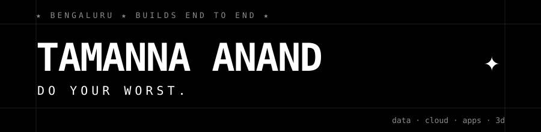

<p align="center"></p>

<p align="center">


</p>

```
★ i build the whole thing: the pipeline, the model, the cloud, the app.
★ then i test it so it doesn't lie to me.
```

## ✦ THE WORK

| | | |
|:--|:--|:--|
| ★ **[SCOUTLINE](https://github.com/tttamannaanand/ScoutLine)** | from-scratch xG model on 38k real shots. pass networks. finds the bargains scouts miss. | **[→ live](https://scout-line.vercel.app)** |
| ★ **[LOTWISE](https://github.com/tttamannaanand/Lotwise-AWS)** | indian capital gains from any broker's mess of a CSV. FIFO lots, FY tax rules, AI that never touches the maths. | **[→ live](https://7rml52kocf.execute-api.us-east-1.amazonaws.com)** |
| ★ **[LUMIDO](https://github.com/tttamannaanand/Lumido)** | 200 drone photos in. 25 million 3D points out. own matching, own stereo, own fusion. | **[→ spin it](https://tttamannaanand.github.io/Lumido/)** |
| ★ **[WHIT](https://github.com/tttamannaanand/WHIT)** | five minutes a day. paywall enforced server-side, because clients lie. | **[→ demo](https://tttamannaanand.github.io/WHIT/)** |
| ★ **[TINTA](https://github.com/tttamannaanand/Tinta)** | type a mood. get its colours, its art, its soundtrack. | **[→ source](https://github.com/tttamannaanand/Tinta)** |

## ✦ THE KIT

<p>


</p>

## ✦ NOW

```
> learning rust the hard way: kvlite, a key-value store over TCP with a write-ahead log.
> it will crash. it will recover. that's the point.
```

<p align="center">☆ ☆ ☆</p>
